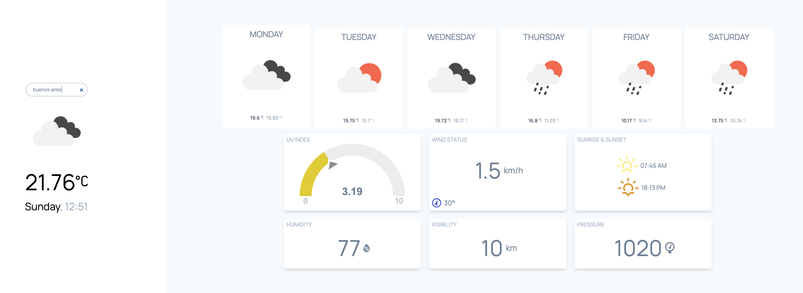

# Weather App

  

> This is a small example of recoil integration in a real web application.

### Features

- [RecoilJS](https://recoiljs.org/) as State Management
- [Tailwind](http://tailwindcss.com/)
- Deploy with [Vercel](https://vercel.com/)
- Developer tools - eslint - prettier

### Run Locally

- Clone this repo and install dependencies.
- Create a personal access token on openweathermap.
- Create an `.env` file and add `REACT_APP_WEATHER_TOKEN` variable with your own token.